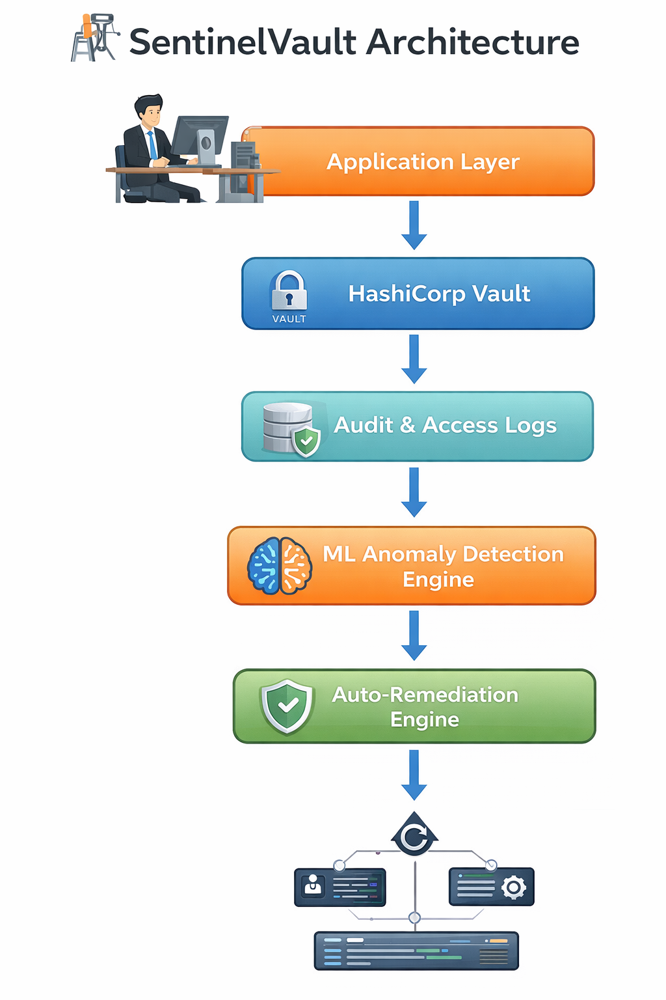

# 🛡️ SentinelVault — AI-Driven Zero-Trust DevSecOps Security Platform

SentinelVault is an **end-to-end DevSecOps security platform** designed to secure, monitor, detect, and automatically respond to abnormal secret access using **Machine Learning and cloud-native observability**.

It demonstrates how modern organizations can implement **Zero-Trust security monitoring** for secrets and credentials across infrastructure.

---

## 🚨 Problem Statement

Organizations securely store API keys and credentials but still lack:

- 🔍 Visibility into secret usage
- 📊 Behavioral monitoring of access patterns
- 🧠 Intelligent threat detection
- ⚡ Automated incident response

Traditional secret management protects storage — **not behavior**.

---

## ✅ Solution — SentinelVault

SentinelVault implements a complete **security lifecycle**:


Secure → Monitor → Detect → Respond


The platform continuously observes secret access behavior, detects anomalies using ML models, and triggers automated responses through a DevSecOps pipeline.

---

## 🏗️ Architecture



### High-Level Flow


HashiCorp Vault
↓
Python Monitoring Service
↓
Prometheus Metrics Collection
↓
ML Anomaly Detection Engine
↓
Grafana Security Dashboard
↓
Auto-Remediation Actions


---

## ⚙️ Core Features

- 🔐 Centralized Secret Management using **HashiCorp Vault**
- 🔎 Secret discovery scanning with **Gitleaks**
- 📊 Audit & telemetry logging
- 🧠 ML-based anomaly detection (Isolation Forest)
- 🚨 Real-time threat visualization dashboard
- 🛡️ Automated security response simulation
- 🚀 DevSecOps CI/CD integration workflow
- 📈 Security posture monitoring via Grafana

---

## 📊 Security Dashboard Capabilities

- Live secret access monitoring
- Threat level classification
- Security score visualization
- Attack simulation monitoring
- Observability-driven security insights

---

## 🧰 Tech Stack

| Category | Tools |
|---|---|
| DevOps | Docker, GitHub Actions |
| Security | HashiCorp Vault, Gitleaks |
| Backend | Python |
| Machine Learning | Scikit-learn (Isolation Forest) |
| Monitoring | Prometheus, Grafana |
| Architecture | Zero Trust Security Model |

---

## ▶️ Demo Workflow

```bash
# Start infrastructure
docker compose up -d

# Secure secret access
python app/app.py

# Prepare ML dataset
python ml-engine/scripts/prepare_dataset.py

# Train anomaly detection model
python ml-engine/scripts/train_model.py

# Detect suspicious behavior
python ml-engine/scripts/detect_anomalies.py

# Trigger automated remediation
python ml-engine/scripts/auto_remediate.py
🧠 Key Learning Outcomes

DevSecOps architecture design

Secure secret lifecycle management

Cloud security observability

Behavioral security analytics

ML-based anomaly detection

Automated incident response workflows

Zero Trust security implementation

🎯 Project Purpose

This project was built to practically demonstrate concepts used in modern:

Cloud Security Engineering

DevSecOps pipelines

Security Operations Center (SOC) monitoring

Zero Trust Architecture

📸 Demo Preview


🚀 Future Enhancements

Real-time remediation automation

Kubernetes secret monitoring

Alert notification integrations

Policy-based access intelligence

👨‍💻 Author

Aman Dhotey
Cloud | DevSecOps | Security Engineering

🔗 LinkedIn:
https://www.linkedin.com/in/aman-dhotey-2723a520

⭐ If you found this project interesting

Give it a ⭐ on GitHub and feel free to share feedback!